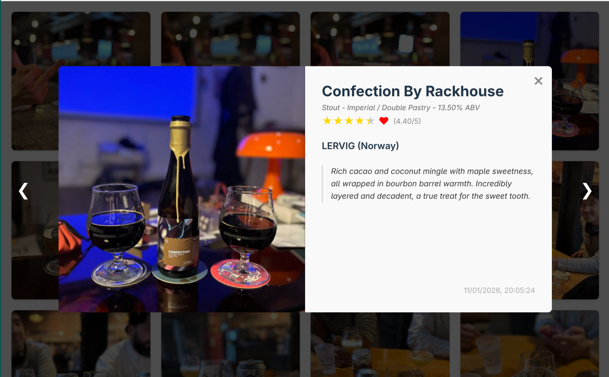

# Beers

This repository hosts my personal beer journal application. It serves Untappd checkins photos automatically stored in a bucket hosted on Cloudflare R2 thanks to [untappd-recorder](https://github.com/smallwat3r/untappd-recorder), and provides a lightweight frontend interface.

The backend API requires the following environment variables:
```
BUCKET_NAME="your_bucket_name"
# Cloudflare R2:
R2_ACCOUNT_ID="your_r2_account_id"
R2_ACCESS_KEY_ID="your_r2_access_key_id"
R2_SECRET_ACCESS_KEY="your_r2_secret_access_key"
R2_PUBLIC_URL="your_r2_public_url"
```


