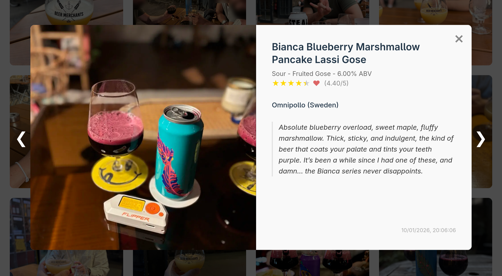

# Beers

This repository hosts my personal beer journal application. It serves Untappd checkins photos automatically stored in a bucket hosted on Cloudflare R2 thanks to [untappd-recorder](https://github.com/smallwat3r/untappd-recorder), and provides a lightweight frontend interface.

It is a static site: the browser reads `index.json` and the photos straight from the public R2 bucket, so there is no backend to run.

## Development

The bucket's public base URL is read from the `.env` file at the root of the repository (see `.env.example`), and baked into the bundle at build time:
```
R2_PUBLIC_URL="your_r2_public_url"
```

Then `make install`, and `make dev` for the dev server or `make build` to write `frontend/dist`.

## Deploying to Cloudflare Pages

Connect the repository, then set:

| Setting | Value |
| --- | --- |
| Root directory | `frontend` |
| Build command | `npm run build` |
| Build output directory | `dist` |

Set `R2_PUBLIC_URL` in the project environment variables, for production and preview.

The bucket needs a CORS policy allowing the site's origins, otherwise the browser refuses to read `index.json`:
```json
[
  {
    "AllowedOrigins": [
      "https://your-project.pages.dev",
      "https://your-custom-domain"
    ],
    "AllowedMethods": ["GET"]
  }
]
```

Origins are matched exactly, so use the deployment's real URL, and purge the Cloudflare cache after a change. `index.json` also wants a short `Cache-Control` on the bucket side, as it sets how quickly a new checkin shows up.


